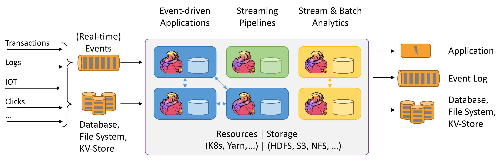

# Flink简介

jdk：

```shell
# 安装jdk，默认路径/usr/lib/jvm
yum install java-1.8.0-openjdk.x86_64
yum install java-devel

# java环境设置，vi /etc/profile
export JAVA_HOME=/usr/lib/jvm/java-1.8.0-openjdk-1.8.0.382.b05-1.el7_9.x86_64
export PATH=$JAVA_HOME/bin:$PATH
export CLASSPATH=.:$JAVA_HOME/lib/dt.jar:$JAVA_HOME/lib/tools.jar
```

maven:

```shell
sudo mv -f apache-maven-3.9.4 /usr/local/

# maven环境设置，sudo vim /etc/profile
export MAVEN_HOME=/usr/local/apache-maven-3.9.4
export PATH=${PATH}:${MAVEN_HOME}/bin
```

```shell
source /etc/profile	# 使环境变量生效
mvn -v
```

使用mven创建项目

```shell
mvn archetype:generate 
	-DgroupId=com.example 				# 指定项目的Group ID（组织标识）
	-DartifactId=my-app 				# 指定项目的Artifact ID（项目标识）
	-DarchetypeArtifactId=maven-archetype-quickstart # 指定用于生成项目的原型
	-DinteractiveMode=false				# 禁用交互模式
```


## **Flink**

**是什么？**基于数据流有状态计算

- 数据流：实时逐条处理无限数据流
- 有状态：保存每个算子计算的中间结果



- **编程模型：**source（数据输入）-》transformation（数据计算）-》sink（数据输出）

  API：SQL/Table API -》DataStream API（流批处理API） -》Stateful Event-Driven Applications（对底层关键计数的操纵，Event，state，time，window）

- **Flink流处理特性：**

  1. 支持**高吞吐，低延迟，高性能**的流处理
  2. 支持带有事件时间的**窗口（Window）**操作
  3. 支持有状态计算的**Exactly-once**语义
  4. 支持高度灵活的窗口（Window）操作，支持基于**time，count，session，以及data-drivern**的窗口操作。
  5. 支持具有**Backpressure**功能的持续流模型
  6. 支持基于轻量级**分布式快照（Snapshot）**实现的容错
  7. 一个运行时同时支持**Batch On Streaming**处理和**Streaming**处理
  8. Flink在JVM内部实现了自己的**内存管理**
  9. 支持迭代计算
  10. 支持程序自动优化：避免特定情况下Shuffle，排序等昂贵操作，中间结果有必要进行缓存。

## 架构

**Flink是主从架构**

- **主节点JobManager：**做集群管理工作，资源管理，任务调度，Checkpoint（容错），心跳检测等
- **从节点TaskManager：**负责具体的任务执行，心跳汇报等。
  - Slot：槽，在Standalone槽固定数量，Yarn

**集群搭建：**

- **Local模式（本地模式）：**一个进程模拟全部的角色，处理所有的代码流程

- **Standalone模式（独立模式）：**主从节点独立进程。

  修改配置：

  - web可视化前端：`rest.address`和`rest.bind-address`，`classloader.bind-address: false`

    http://9.134.117.196:8081/访问web页面

  - slot个数配置：`taskmanager.numberOfTaskSlots: 6`

  启动：`./bin/start-cluster.sh`，`./bin/stop-cluster.sh`

  生产：`bin/flink run` ，在前端可以看运行的Job

  设置一下环境变量：方便找安装目录

  ```
  export FLINK_HOME=/export/server/flink
  export PATH=$PATH:$FLINK_HOME/bin
  source /etc/profile
  ```

- **Yarn模式：**

  |                     | **特点**                                                     | **优点**                                                     | **缺点**                                                     |
  | ------------------- | ------------------------------------------------------------ | ------------------------------------------------------------ | ------------------------------------------------------------ |
  | **Session模式**     | 是一种长期运行的模式，启动时只创建JobManager，每次提交任务时YARN请求资源创建TaskManager执行任务，执行结束销毁TaskManager | 可以快速启动和执行多个应用程序，共享资源，减少启动和关闭的开销。适用于长期运行的服务和交互式应用程序。 | 资源分配相对固定，不够灵活。需要手动管理和监控Session。      |
  | **Per-Job模式**     | 是一种短期运行的模式，每次提交一个任务时，都会启动一个新的Flink集群。应用程序执行完成后，集群会自动关闭。 | 每个应用程序都有独立的资源分配，可以根据应用程序的需求进行灵活的资源管理。适用于短期运行的批处理作业和流处理作业。 | 启动和关闭的开销较大，每次提交应用程序都需要重新分配资源。   |
  | **Application模式** | - 一种介于Session模式和Per-Job模式之间的模式，每次提交一个应用程序时，会启动一个新的Flink集群，但集群会保持运行状态，以便可以提交和执行多个应用程序。<br> | 每个应用程序都有独立的资源分配，可以根据应用程序的需求进行灵活的资源管理。可以提交和执行多个应用程序，共享运行环境。 | 启动和关闭的开销较大，每次提交应用程序都需要重新分配资源。需要手动管理和监控应用程序。 |

  - 在传统的Flink部署方式中，客户端节点需要具备足够的计算和内存资源来运行Flink的ApplicationMaster。这可能会导致客户端节点的资源受限。YARN Application模式通过将Flink的ApplicationMaster部署在YARN集群中，解决了客户端节点资源受限的问题。

  黑马讲的和chatgpt有出入

  | 选项        | Yarn-session                                         | Per-job                    | Application                |
  | ----------- | ---------------------------------------------------- | -------------------------- | -------------------------- |
  | 启动步骤    | 2步（1.yarn-session.sh; 2.提交任务）                 | 1步（提交任务）            | 1步（提交任务）            |
  | JobManager  | 在第一步启动，不会销毁，长期运行                     | 随着任务的提交而产生       | 随着任务的提交而产生       |
  | TaskManager | 在第二步启动，任务运行完之后销毁                     | 随着任务的销毁而销毁       | 随着任务的销毁而销毁       |
  | 客户端进程  | 在客户端节点                                         | 在客户端节点               | 在集群中某个节点           |
  | 适用范围    | 所有任务都公用一套集群，适合小任务，适合频繁提交场景 | 适用大任务，非频繁提交场景 | 适用大任务，非频繁提交场景 |

## 流式计算

<<<<<<< HEAD
|          | 批量计算                                                     | 流式计算                                                     |
| -------- | ------------------------------------------------------------ | ------------------------------------------------------------ |
| 处理方式 | 批量处理（一批数据为单位进行处理）<br>全量计算（对整个数据集进行计算和处理） | 逐条处理（来一条处理一条，不是处理整个数据集）<br>增量计算（对每个数据进行增量处理，而不是计算整个数据集） |
| 时效性   | 延迟处理（数据会被收集一段时间，形成一个批次后再进行处理）   | 实时性（数据到达立即进行处理）                               |
| 输入数据 | 有限数据集（有界，数据集可以是一段时间内的数据）             | 无限数据流（kafka等连续接收数据）                            |
|          | 数据一致性（完整性：确保所有数据都会被处理，不漏数据。去重性：避免重复处理同一数据，保证结果的准确性） | 状态管理（计算中间结果，维护状态信息来跟踪数据处理过程）     |
|          | 离线环境（通常在离线环境中进行，即数据已经被收集完毕后进行处理。可以在较为稳定的环境中进行，不需要实时响应和即时处理） | 可扩展性（水平扩展，通过并行提高吞吐量和处理能力）           |
| 使用场景 | 对历史数据的处理，对时效性要求不高。 <br>但是对时效性要求高的场景并不适用（实时监控网站一场情况，实时监控道路拥堵情况，实时监控全国疫情爆发情况，事实监控网站成交情况） |                                                              |

## Flink开发

1. **Flink分层API**
   - SQL/Table API（最顶层）StreamTableEnvironment
   - DataStream API（中间层）StreamExecutionEnvironment
   - Stateful Function（最底层）
2. **Flink程序开发流程**
   1. 构建流式执行环境
   2. 数据输入
   3. 数据处理
   4. 数据输出
   5. 启动流式
3. **需求：**使用Flink程序，进行Wordcount单词统计
=======
|              | 批量计算                                                     | 流式计算                                                     |
| ------------ | ------------------------------------------------------------ | ------------------------------------------------------------ |
| **处理方式** | 批量处理（一批数据为单位进行处理）<br>全量计算（对整个数据集进行计算和处理） | 逐条处理（来一条处理一条，不是处理整个数据集）<br>增量计算（对每个数据进行增量处理，而不是计算整个数据集） |
| **时效性**   | 延迟处理（失效性低，数据会被收集一段时间，形成一个批次后再进行处理） | 实时性（数据到达立即进行处理）                               |
| **输入数据** | 有限数据集（有界，数据集可以是一段时间内的数据）             | 无限数据流（kafka等连续接收数据）                            |
|              | 数据一致性（完整性：确保所有数据都会被处理，不漏数据。去重性：避免重复处理同一数据，保证结果的准确性） | 状态管理（计算中间结果，维护状态信息来跟踪数据处理过程）     |
|              | 离线环境（通常在离线环境中进行，即数据已经被收集完毕后进行处理。可以在较为稳定的环境中进行，不需要实时响应和即时处理） | 可扩展性（水平扩展，通过并行提高吞吐量和处理能力）           |
|              | 对历史数据的处理，对时效性要求不高（去年数据，上个月数据消费账单）。<br>但是对时效性要求高的场景并不适用（实时监控网站一场情况，实时监控道路拥堵情况，实时监控全国疫情爆发情况，事实监控网站成交情况） |                                                              |

**Flink安装部署：**

- Local
- Standalone
- Yarn
  - Yarn-session
  - per-job（client）
  - application（cluster）
- Flink入门案例
  - 批处理（已过期）
  - 流处理（DataStream API，Table API，SQL）
>>>>>>> ce01746b3846927a2b900570a1c8ef155c3ef83a
