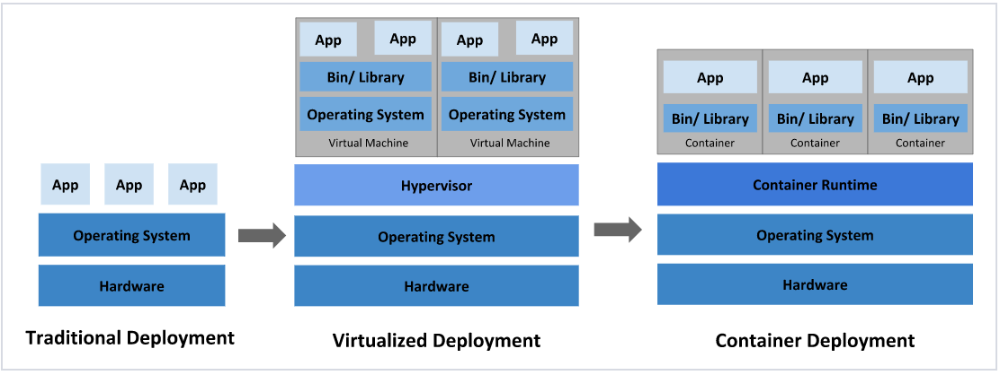
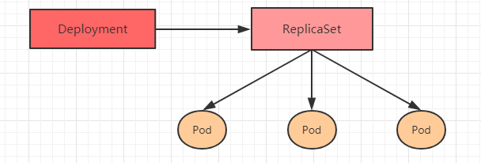

# kubernetes介绍

## 应用部署演变

在部署应用程序的方式上，主要经历了三个时代：

- **传统部署**：互联网早期，会直接将应用程序部署在物理机上

  > 优点：简单，不需要其它技术的参与
  >
  > 缺点：不能为应用程序定义资源使用边界，很难合理地分配计算资源，而且程序之间容易产生影响

- **虚拟化部署**：可以在一台物理机上运行多个虚拟机，每个虚拟机都是独立的一个环境

  > 优点：程序环境不会相互产生影响，提供了一定程度的安全性
  >
  > 缺点：增加了操作系统，浪费了部分资源

- **容器化部署**：与虚拟化类似，但是共享了操作系统

  > 优点：
  >
  > ​    可以保证每个容器拥有自己的文件系统、CPU、内存、进程空间等
  >
  > ​    运行应用程序所需要的资源都被容器包装，并和底层基础架构解耦
  >
  > ​    容器化的应用程序可以跨云服务商、跨Linux操作系统发行版进行部署
  >
  



容器化所带来的问题：

- 一个容器故障停机了，怎么样让另外一个容器立刻启动去替补停机的容器（存活探针）
- 当并发访问量变大的时候，怎么样做到横向扩展容器数量（HPA）

上述容器管理的问题统称为**容器编排**问题，为了解决这些容器编排问题，就产生了一些容器编排的工具软件：其中市场占有率最高的是Google开源的kubernetes

## kubernetes简介

kubernetes的本质是**一组服务器集群**，**它可以在集群的每个节点上运行特定的程序，来对节点中的容器进行管理。目的是实现资源管理的自动化**，主要提供了如下的主要功能：


- **自我修复**：一旦某一个容器崩溃，能够在1秒中左右迅速启动新的容器

  > 探针？怎么实现的

- **弹性伸缩**：可以根据需要，自动对集群中正在运行的容器数量进行调整（`kubectl edit`、`kubectl scale`）

  > HPA?怎么实现的

- **服务发现**：服务可以通过自动发现的形式找到它所依赖的服务

  > iptable?怎么实现的

- **负载均衡**：如果一个服务起动了多个容器，能够自动实现请求的负载均衡

  > 怎么实现的

- **版本回退**：如果发现新发布的程序版本有问题，可以立即回退到原来的版本

  > 怎么实现的

- **存储编排**：可以根据容器自身的需求自动创建存储卷

  > 怎么实现的

## kubernetes组件

1. 每个节点都安装特定的程序，节点上的程序是否都是一样的？

   一个kubernetes集群主要是由**控制节点(master)**、**工作节点(node)**构成，每个节点上都会安装**不同的组件**。

2. 每个节点上安装的程序是什么？

   **master：集群的控制平面，负责集群的决策  (  管理  )**

   > **ApiServer** : 资源操作的唯一入口，接收用户输入的命令`kubectl`，提供认证、授权、API注册和发现等机制（接收操作请求，k8s控制的访问入口）
   >
   > **Scheduler** : 负责集群资源调度，按照预定的调度策略将Pod调度到相应的node节点上（请求给哪个node去做）
   >
   > **ControllerManager** : 负责维护集群的状态，比如程序部署安排、故障检测、自动扩展、滚动更新等（分配请求到node）
   >
   > **Etcd **：负责存储集群中各种资源对象的信息（数据库）

   **node：集群的数据平面，负责为容器提供运行环境 ( 干活 ) **

   > **Kubelet** : 负责维护容器的生命周期，即通过控制docker，来创建、更新、销毁容器
   >
   > **KubeProxy** : 负责提供集群内部的服务发现和负载均衡（服务之间的访问）
   >
   > **Docker** : 负责节点上容器的各种操作

3. kubernetes特定的程序如何配合工作把程序跑起来的？


下面，以部署一个nginx服务来说明kubernetes系统各个组件调用关系：

1. 首先要明确，一旦kubernetes环境启动之后，master和node都会将自身的信息存储到etcd数据库中

2. 一个nginx服务的安装请求会首先被发送到master节点的apiServer组件

3. apiServer组件会调用scheduler组件来决定到底应该把这个服务安装到哪个node节点上

   在此时，它会从etcd中读取各个node节点的信息，然后按照一定的算法进行选择，并将结果告知apiServer

4. apiServer调用controller-manager去调度Node节点安装nginx服务

5. kubelet接收到指令后，会通知docker，然后**由docker来启动一个nginx的容器**

   pod是kubernetes的最小操作单元，容器必须跑在pod中

6. 如果需要访问nginx，就需要通过kube-proxy来对pod产生访问的代理

​        这样，外界用户就可以访问集群中的nginx服务了

## kubernetes概念

- **Master**：集群控制节点，每个集群需要至少一个master节点负责集群的管控
- **Node**：工作负载节点，由master分配容器到这些node工作节点上，然后node节点上的docker负责容器的运行
- **Pod**：kubernetes的最小控制单元，容器都是运行在pod中的，一个pod中可以有1个或者多个容器
  - 只能在master节点上使用kubctl，如果想要在Pod中使用kubctl，把master节点上$HOME/.kube配置文件复制到node节点
- **Controller**：控制器，**通过它来实现对pod的管理**，比如启动pod、停止pod、伸缩pod的数量等等
- **Service**：pod对外服务的统一入口，下面可以维护者同一类的多个pod
- **Label**：标签，用于对pod进行分类，同一类pod会拥有相同的标签
  - 下面的service是怎么知道要把流量分到哪些pod上呢？打不同的标签，选择器选择不同标签的pod
- **NameSpace**：命名空间，用来隔离pod的运行环境


- ip的dns映射，主机名解析
- 时间同步
- 关闭iptables服务
- 关闭selinux
- 禁用swap
- 修改linux内核参数
- 配置ipvs功能
  - service有两种代理模型，一种基于iptables，一种基于ipvs，ipvs性能更高
- 阿里云镜像有问题

- kubectl get service -nhlmj3dout

  外部访问11.167.80.98:30893  内部集群访问：11.166.207.85:50051

  ```
  pushgateway  LoadBalancer   11.166.207.85    11.167.80.98   50051:31657/TCP,50052:30893/TCP         601d
  ```

  

## Kubernetes资源管理

控制器生成各种各样的pod，pod中有多个容器，pod持久化存储--加载卷，pod对外暴露service


- **命令式对象管理：**直接使用命令去操作kubernetes资源（只能操作活动对象，无法审计、跟踪）（一般用在临时查询一下信息）

  ```shell
  kubectl [command] [type] [name] [flags]
  ```

  > **comand**：指定要对资源执行的操作，例如create、get、delete
  >
  > **type**：指定资源类型，比如deployment、pod、service
  >
  > **name**：指定资源的名称，名称大小写敏感
  >
  > **flags**：指定额外的可选参数
  >
  - `command`：命令，对资源的操作
  
	  <table>
	  	<tr>
	  	    <th>命令分类</th>
	  	    <th>命令</th>
	  		<th>翻译</th>
	  		<th>命令作用</th>
	  	</tr>
	  	<tr>
    	    <td rowspan="6">基本命令</td>
	  	    <td>create</td>
	  	    <td>创建</td>
	  		<td>创建一个资源</td>
	  	</tr>
	  	<tr>
	  		<td>edit</td>
	  	    <td>编辑</td>
	  		<td>编辑一个资源</td>
	  	</tr>
	  	<tr>
	  		<td>get</td>
	  	    <td>获取</td>
	  	    <td>获取一个资源</td>
	  	</tr>
	     <tr>
	  		<td>patch</td>
	  	    <td>更新</td>
	  	    <td>更新一个资源</td>
	  	</tr>
	  	<tr>
	  	    <td>delete</td>
	  	    <td>删除</td>
	  		<td>删除一个资源</td>
	  	</tr>
	  	<tr>
	  	    <td>explain</td>
	  	    <td>解释</td>
	  		<td>展示资源文档</td>
	  	</tr>
	  	<tr>
	  	    <td rowspan="10">运行和调试</td>
	  	    <td>run</td>
	  	    <td>运行</td>
	  		<td>在集群中运行一个指定的镜像</td>
	  	</tr>
	  	<tr>
	  	    <td>expose</td>
	  	    <td>暴露</td>
	  		<td>暴露资源为Service</td>
	  	</tr>
	  	<tr>
	  	    <td>describe</td>
	  	    <td>描述</td>
	  		<td>显示资源内部信息</td>
	  	</tr>
	  	<tr>
	  	    <td>logs</td>
	  	    <td>日志</td>
	  		<td>输出容器在 pod 中的日志</td>
	  	</tr>	
	  	<tr>
	  	    <td>attach</td>
	  	    <td>缠绕</td>
	  		<td>进入运行中的容器</td>
	  	</tr>	
	  	<tr>
	  	    <td>exec</td>
	  	    <td>执行</td>
	  		<td>执行容器中的一个命令</td>
	  	</tr>	
	  	<tr>
    	    <td>cp</td>
	  	    <td>复制</td>
	  		<td>在Pod内外复制文件</td>
	  	</tr>
	  		<tr>
	  		<td>rollout</td>
	  	    <td>首次展示</td>
	  		<td>管理资源的发布</td>
	  	</tr>
	  	<tr>
	  		<td>scale</td>
	  	    <td>规模</td>
	  		<td>扩(缩)容Pod的数量</td>
	  	</tr>
	  	<tr>
	  		<td>autoscale</td>
	  	    <td>自动调整</td>
	  		<td>自动调整Pod的数量</td>
	  	</tr>
	  	<tr>
	  		<td rowspan="2">高级命令</td>
	  	    <td>apply</td>
	  	    <td>rc</td>
	  		<td>通过文件对资源进行配置</td>
	  	</tr>
	  	<tr>
	  	    <td>label</td>
	  	    <td>标签</td>
	  		<td>更新资源上的标签</td>
	  	</tr>
	  	<tr>
	  		<td rowspan="2">其他命令</td>
    	    <td>cluster-info</td>
    	    <td>集群信息</td>
    		<td>显示集群信息</td>
    	</tr>
    	<tr>
    	    <td>version</td>
    	    <td>版本</td>
    		<td>显示当前Server和Client的版本</td>
    	</tr>
    </table>
  
  - `type`：资源类型`kubectl api-resources`
  
    <table>
    	<tr>
    	    <th>资源分类</th>
    	    <th>资源名称</th>
    		<th>缩写</th>
    		<th>资源作用</th>
    	</tr>
    	<tr>
    	    <td rowspan="2">集群级别资源</td>
            <td>nodes</td>
    	    <td>no</td>
    		<td>集群组成部分</td>
    	</tr>
    	<tr>
    		<td>namespaces</td>
    	    <td>ns</td>
    		<td>隔离Pod</td>
    	</tr>
    	<tr>
    		<td>pod资源</td>
    	    <td>pods</td>
    	    <td>po</td>
    		<td>装载容器</td>
    	</tr>
    	<tr>
    		<td rowspan="8">pod资源控制器</td>
    	    <td>replicationcontrollers</td>
    	    <td>rc</td>
    		<td>控制pod资源</td>
    	</tr>
    	<tr>
    	    <td>replicasets</td>
    	    <td>rs</td>
    		<td>控制pod资源</td>
    	</tr>
    	<tr>
    	    <td>deployments</td>
    	    <td>deploy</td>
    		<td>控制pod资源</td>
    	</tr>
    	<tr>
    	    <td>daemonsets</td>
    	    <td>ds</td>
    		<td>控制pod资源</td>
    	</tr>
    	<tr>
    	    <td>jobs</td>
    	    <td></td>
    		<td>控制pod资源</td>
    	</tr>	
    	<tr>
    	    <td>cronjobs</td>
    	    <td>cj</td>
    		<td>控制pod资源</td>
    	</tr>	
    	<tr>
    	    <td>horizontalpodautoscalers</td>
    	    <td>hpa</td>
    		<td>控制pod资源</td>
    	</tr>	
    	<tr>
    	    <td>statefulsets</td>
    	    <td>sts</td>
    		<td>控制pod资源</td>
    	</tr>
    	<tr>
    		<td rowspan="2">服务发现资源</td>
    	    <td>services</td>
    	    <td>svc</td>
    		<td>统一pod对外接口</td>
    	</tr>
        <tr>
    	    <td>ingress</td>
    	    <td>ing</td>
    		<td>统一pod对外接口</td>
    	</tr>
    	<tr>
    		<td rowspan="3">存储资源</td>
    	    <td>volumeattachments</td>
    	    <td></td>
    		<td>存储</td>
    	</tr>
    	<tr>
    	    <td>persistentvolumes</td>
    	    <td>pv</td>
    		<td>存储</td>
    	</tr>
    	<tr>
    	    <td>persistentvolumeclaims</td>
    	    <td>pvc</td>
    		<td>存储</td>
    	</tr>
    	<tr>
    		<td rowspan="2">配置资源</td>
    	    <td>configmaps</td>
    	    <td>cm</td>
    		<td>配置</td>
    	</tr>
    	<tr>
    	    <td>secrets</td>
    	    <td></td>
    		<td>配置</td>
    	</tr>
    </table>


- **命令式对象配置：**通过命令配置和配置文件去操作kubernetes资源（增删改查）（可以审计、跟踪）（项目大时，配置文件多，操作麻烦）

  ```shell
  kubectl create/delete/patch(edit)/get -f 配置文件.yaml
  ```

- **声明式对象配置：**通过apply命令和配置文件去操作kubernetes资源（新增和更新）（支持目录操作）（意外情况下难以调试）

  ```shell
  kubectl apply -f 配置文件.yaml
  ```

  > 使用apply操作资源：
  >
  > - 如果资源不存在，就创建，相当于 kubectl create
  > - 如果资源已存在，就更新，相当于 kubectl patch

- kubectl命令需要HOME/.kube文件配置，node上没有需要从master上拷贝一个

# 实战入门

## Namespace

主要作用是用来实现**多套环境的资源隔离**或者**多租户的资源隔离**。

> **多套环境的资源隔离**： 默认情况下，kubernetes集群中的所有的Pod都是可以相互访问的。但是在实际中，可能**不想让两个Pod之间进行互相的访问**，那此时就可以将两个Pod划分到不同的namespace下。kubernetes通过将集群内部的资源分配到不同的Namespace中，可以形成逻辑上的"组"，以方便不同的组的资源进行隔离使用和管理。（dev组和test组两个组之间不需要相互访问，可以使用namespace）

> **多租户的资源隔离**：可以通过kubernetes的授权机制，**将不同的namespace交给不同租户进行管理**，这样就实现了多租户的资源隔离。此时还能结合kubernetes的资源配额机制，限定不同租户能占用的资源，例如CPU使用量、内存使用量等等，来实现租户可用资源的管理。

**默认创建的Namespace：**

```shell
[root@master ~]# kubectl  get namespace
NAME              STATUS   AGE
default           Active   45h     #  所有未指定Namespace的对象都会被分配在default命名空间
kube-node-lease   Active   45h     #  集群节点之间的心跳维护，v1.13开始引入
kube-public       Active   45h     #  此命名空间下的资源可以被所有人访问（包括未认证用户）
kube-system       Active   45h     #  所有由Kubernetes系统创建的资源都处于这个命名空间
```

**增删查：**

```shell
kubectl create/delete/get/describe ns namespace名称
```

```
apiVersion: v1
kind: Namespace
metadata:
	name: dev
```

## Pod

Pod是kubernetes集群进行管理的最小单元，程序要运行必须部署在容器中，而容器必须存在于Pod中。

Pod可以认为是容器的封装，一个Pod中可以存在一个或者多个容器。

kubernetes在集群启动之后，集群中的各个组件也都是以Pod方式运行的。运行在kube-system的Namespace下。


**增删改查：**

```shell
# 增：创建deployment控制器，启动pod
# --image:指定Pod的镜像，--port:指定端口，--namespace:指定namespace
kubectl run/delete/get/describe nginx --image=nginx:1.17.1 --port=80 --namespace dev

# 删掉会由deploy重新创建
# 查：查看Pod基本信息(Pause根容器看不到), 描述查看Pod的详细信息(可以查看pod最近的事件)
```

## Label

**作用：**就是在资源上添加标识，用来对它们进行区分和选择。（frontend组和backend组之间需要通信，用namespace不同namespace下的pod不能同i性能，可以使用label）

**特点：**

- key/value形式附加到各种资源对象上（Node、Pod、Service等）
- 一个资源对象可以有多个label，一个label也可以标记多个资源对象

- Label通常在资源对象定义时确定，当然也可以在对象创建后动态添加或者删除

> 一些常用的Label 示例如下：
>
> - 版本标签："version":"release", "version":"stable"......
> - 环境标签："environment":"dev"，"environment":"test"，"environment":"pro"
> - 架构标签："tier":"frontend"，"tier":"backend"

**Label Selector**：标签定义完毕之后，还要考虑到标签的选择，这就要使用到Label Selector

- Label用于给某个资源对象定义标识，Label Selector用于查询和筛选拥有某些标签的资源对象
- 当前有两种Label Selector：`=\!=`和`in\not in(...,)`
  - 基于等式的Label Selector：`-l version=1.0`
  - 基于集合的Label Selector: `-l version in(1.0, 1.1, 1.2)`

- 标签的选择条件可以使用多个，用`,`分割：`-l version=1.0, env=dev`

```shell
# 增
kubectl label pod nginx-pod 标签key=标签value -n dev
# 删: 标签key-
kubectl label pod nginx-pod 标签key- -n dev
# 改: --overwrite
kubectl label pod nginx-pod 标签key=标签value -n dev --overwrite
# 查: --show-labels
kubectl get pod nginx-pod  -n dev --show-labels
# 筛选
kubectl get po -n dev -l version=2.0 --show-labels
```


## Pod控制器

Pod是k8s最小的控制单元，k8s一般通过Pod控制器，很少直接控制Pod。

- Pod控制器用于pod的管理，确保pod资源符合预期的状态，当pod的资源出现故障时，会尝试进行重启或重建pod（高可用）。
- Pod控制器通过Pod上的Label来识别属于自己管理的Pod。


```shell
kubectl run 名字 --image=nginx:1.17.2 --port=80 --replicas=3 -n dev
kubectl get deploy -n dev -o wide
kubectl delete deploy 名字 -n dev
```

```yaml
apiVersion: apps/v1
kind: Deployment
metadata:
  name: nginx
  namespace: dev
spec:
  replicas: 3
  selector:
    matchLabels:
      run: nginx   
  template: # pod的配置
    metadata:
      labels:
        run: nginx
    spec:
      containers:
      - image: nginx:1.17.1
        name: nginx
        ports:
        - containerPort: 80
          protocol: TCP
```


## Service

通过Deployment创建一个高可用的服务，每个Pod都会有一个内部集群IP，会存在以下问题：

- Pod 虚拟IP，当Pod重启时会变化，且外部无法访问

多个pod需要对外提供一个访问接口

**Service：**可看作一组同类Pod对外访问接口。通过Service可以方便的实现**服务发现**和**负载均衡**。

- Service和Pod控制器一样也是通过label机制来识别自己的分组（创建时通过Pod控制器来找标签）
- Service在整个生命周期IP不会改变


```shell
# 增：暴露Service deploy控制器管理的Pod 
# --name=服务名 --type=类型（ClusterIP只能集群内部访问, NodePort集群外部访问） 
# --port=Service的端口 --target-port=转发到Pod的端口
kubectl expose deploy nginx --name=svc-nginx1 --type=ClusterIP --port=80 --target-port=80
# 删：只删除服务，Pod和Pod控制器没有被删除
kubectl delete svc svc-nginx-1 -n dev
# 查
kubectl get svc -ndev # NodePort时 PORTS(S)为80:30740/TCP, 表示发到NodeIP:30740的请求被转发到CLUSTER-IP:80端口上
```

```yaml
apiVersion: v1
kind: Service
metadata:
	name: svc-nginx
	namespace: dev
spec:
	clusterIP: 10.109.179.231
	ports:
	- port: 80
	  protocol: TCP
	  targetPort: 80
	selector:
	  run: nginx
	type: ClusterIP
```


# Pod详解

k8s所有配置的metadata都包含三个元素：

```yaml
metadata:
	name: 名字
	namespace: 名称空间
	labels: 标签
```

## Pod结构


每个Pod中包含一个或多个容器：

- **用户容器：**用户程序所在的容器

- **Pause容器：**每个Pod都会有的根容器，作用有两个：

  1. 以Pause容器为依据，**评估整个Pod的健康状态**

  2. **可以在Pause容器上设置IP地址，其他容器都使用该IP（Pod IP），实现Pod网络内部的通信**

     > 这里是Pod内部的通讯，Pod的之间的通讯采用虚拟二层网络技术来实现，我们当前环境用的是Flannel

## Pod资源配置

不清楚的配置可以通过文档或者 `kubectl explain pod.属性.属性`命令一层一层来查看，下面是explain pod最外层的资源

```yaml
# 简略信息
# 所有资源的一级属性都是一样的，主要包含5部分（写yaml看前4个）
apiVersion: <string>   # 版本，   k8s内部定义，必须能用kubectl api-versions查询到
kind: <string>         # 资源类型，k8s内部定义，必须能用kubectl api-resources查询到
metadata: <Object>     # 元数据， 主要是资源标识和说明，常用的有name、namespace、labels等  
spec: <Object>  	   # 描述，   这是配置中最重要的一部分，里面是对各种资源配置的详细描述
status:	<Object>	   # 状态信息，里面的内容不需要定义，由kubernetes自动生成
```

常见的spec子属性

```yaml
containers   <[]Object> -required-	# 容器列表，用于定义容器的详细信息 
nodeName     <string>				# 根据nodeName的值将pod调度到指定的Node节点上
nodeSelector <map[string]string>	# 根据NodeSelector中定义的信息选择将该Pod调度到包含这些label的Node 上
hostNetwork  <boolean>				# 是否使用主机网络模式，默认为false，如果设置为true，表示使用宿主机网络(一般都是false，不然多个pod在同一个node上会端口冲突)
volumes      <[]Object>				# 存储卷，用于定义Pod上面挂在的存储信息 
restartPolicy        <string>		# 重启策略，表示Pod在遇到故障的时候的处理策略   
```

## **containers配置**

容器配置，数组中元素配置，访问程序是pod的ip：container的端口

  ```yaml
  name: <string>		# 容器名称，自己起的名
  image: <string>		# 容器需要的镜像地址，nginx:1.71.2
  imagePullPolicy: <string> # 镜像拉取策略: 
  		# always只远程拉取；ifNotPresnet本地有就本地拉取，没有就远程拉取；Nerver，只本地拉取，本地没有就报错
          # 默认值：有tag具体版本号默认ifNotPresnet；没有就是latest默认always     
  command: <[]string> # 容器的启动命令列表（容器初始化完毕后运行），如不指定，使用打包时使用的启动命令
  args: <[]string> 	# 容器的启动命令需要的参数列表
         # 通过command可以完成启动命令和传递参数的功能，为什么这里还要提供一个args选项，用于传递参数呢?这其实跟docker有点关系，kubernetes中的command、args两项其实是实现覆盖Dockerfile中ENTRYPOINT的功能。
         # 1 如果command和args均没有写，那么用Dockerfile的配置。
         # 2 如果command写了，但args没有写，那么Dockerfile默认的配置会被忽略，执行输入的command
         # 3 如果command没写，但args写了，那么Dockerfile中配置的ENTRYPOINT的命令会被执行，使用当前args的参数
         # 4 如果command和args都写了，那么Dockerfile的配置被忽略，执行command并追加上args参数
  
  env: <[]object>		# 容器环境变量的配置（容器内部的）（推荐使用配置文件的方式）
  ports: <[]object>	# 容器需要暴露的端口号列表
      name <string>			# 端口名称，如果指定，必须保证name在pod中是唯一的
      containerPort <integer> # 容器要监听的端口(0<x<65536)
      hostPort     <integer>  # 容器要在主机上公开的端口，如果设置，主机上只能运行容器的一个副本(一般省略) (容器端口映射到主机端口(多个容器映射到同一个主机端口，就会端口冲突))
      hostIP       <string>  # 要将外部端口绑定到的主机IP(一般省略)
      protocol     <string>  # 端口协议。必须是UDP、TCP或SCTP。默认为“TCP”。
  resources: <object>	# 资源限制和资源请求的设置（防止容器占用大量资源导致其他容器无法运行，资源不够下限了pending挂起，scheduler调度不到合适的node）
      # Warning  FailedScheduling  <unknown>  default-scheduler  0/2 nodes are available: 2 Insufficient memory.(内存不足)
      limits:		# 限制资源上限cpu:"1"，memory:"10Mi"
      requests:	# 所需资源下限
  ```
##  Pod生命期

**pod的生命期过程：**

- pod创建过程
- 运行初始化容器(init container，容器的一种)过程
- 运行主容器过程（main container）过程
  - 容器启动后钩子（post start）、容器终止前钩子（pre stop）
  - 容器的存货性探测（liveness probe）、就绪性探测（readiness probe）
- pod终止过程

**Pod的5种状态（相位）：**

- 挂起（Pending）：apiserver已经创建了pod资源对象，但它尚未被调度完成或者仍处于下载镜像的过程中（调度中？）

  > -  CrashLoopBackOff：一直在重试重启失败的容器
  > - PodInitializing：Event是None

- 运行中（Running）：pod已经被调度至节点，并且所有容器都已经被kubelet创建完成

- 成功（Succeeded）：pod中的所有容器都已经成功终止并且不会被重启

- 失败（Failed）:所有容器都已经充值，但至少有一个容器终止失败，即容器返回了非0值的退出状态

- 未知（Unknown）:apiserver无法正常获取到pod对象的状态信息，通常由网络通信失败所导致


1. **Pod创建**

   - `kubectl`客户端提交需要创建的`pod`信息给`apiServer`

   - `apiServer`生成pod对象的信息，并将pod信息存入`etcd`，直接向客户端返回确认信息

   - `apiServer`反应`etcd`中`pod`对象的变化，**其他组件使用`watch`机制跟踪`apiServer`上的变化**

   - **`scheduler`监听**到`apiServer`新pod对象创建信息，为pod分配主机并将结果信息**更新至`apiServer`**

   - `node`节点上的**`kubelet`监听到**有`pod`调度过来，尝试调用`docker`启动容器，并将结果**回送至`apiServer`**

   - `apiServer`将接收到的`pod`状态信息（`status`）存入`etcd`

2. **Pod销毁**
   
   1. `kubectl`发命令
   
   2. `apiServer`中pod信息随时间推移而更新，宽限期内（默认30s），pod视为dead
   
   3. 将pod标记为`terminating`
   
   4. `kubelet`在`watch`到`pod`对象为`terminating`状态，启动`pod`关闭过程
   
   5. 端点控制器`watch`到`pod`对象的关闭行为，从所有匹配到此端点的`service`资源的端点列表中移除该`pod`
   
   6. 在标记为`terminating`后同步执行定义的`preStop`钩子处理器
   
   7. `pod`中容器接收停止信号
   
   8. 超过宽限期，pod中容器仍在运行，pod对象收到立即终止信号
   
   9. `kubelet`请求`apiServer`将此`pod`资源的宽限期设置为0从而完成删除操作，此时pod对于用户已不可见
   
   

### **初始化容器`init container`**

   - 初始化容器是在pod的主容器启动之前要运行的容器，主要是做一些主容器的前置工作。
   - 按照定义的顺序串行执行，初始化容器失败会一直重启直至成功。

   - **应用场景：**

     1. 提供主容器镜像中不具备的工具程序或自定义代码（sidecar）
     2. 延后应用容器的启动直至其依赖的条件得到满足（初始化容器要先于应用容器串行启动并运行完成，比如nginx运行前要求能连接mysql，redis等）

   - **使用：**`initContainers`字段，内容与普通的`containers`字段相同

     ```yaml
     initContainers:
     - name: <string>
       <...>
     ```

### 主容器`container`

#### **钩子函数**lifecycle

- `postStart`：容器启动后钩子，容器创建之后执行，如果失败了会以一定策略重启容器

- `preStop`：容器终止前钩子，容器终止之前执行，执行完成之后容器将成功终止，在其完成之前会阻塞删除容器的操作

- 支持三种方式定义动作：`exec`、`TCPSocket`、`HTTPGet`

  1. `exec`：在容器内执行一次命令（常用）

     ```yaml
     lifecycle:
       postStart:
         exec:
           command:
           - cat
           - /tmp/healthy
     ```

  2. `TCPSocket`：在当前容器尝试访问指定的socket

     ```yaml
     lifecycle:
         postStart:
           tcpSocket:
             port: 8080
     ```

  3. `HTTPGet`：在当前容器中向某url发起http请求

     ```yaml
     lifecycle:
         postStart:
           httpGet:
             path: / #URI地址
             port: 80 #端口号
             host: 192.168.109.100 #主机地址
             scheme: HTTP #支持的协议，http或者https
     ```

#### **容器探测**Probe 

容器探测用于检测容器中的应用实例是否正常工作，是保障业务可用性的一种传统机制。

- `livenessProbe`：存活性探针，用于检测应用实例当前是否处于正常运行状态，如果不是，k8s会**重启容器**

- `readinessProbe`：就绪性探针，用于检测应用实例当前是否可以接收请求，如果不能，**service不会转发流量**

- 支持三种探测方式：跟上面的钩子函数一样，支持exec，tcpSocket，httpGet三种方式

  - `exec`：在容器内执行一次命令，如果命令执行的**退出码为0**，则认为程序正常，否则不正常。

  - `tcpSocket`：将会尝试访问一个用户容器的端口，如果能够**建立这条连接**，则认为程序正常，否则不正常
  
  - `httpGet`：调用容器内Web应用的URL，如果返回的**状态码在200和399之间**，则认为程序正常，否则不正常
  
- 参数：kubectl explain pod.spec.containers.livenessProbe

  ```yaml
  exec 		<Object>
  tcpSocket 	<Object>
  httpGet		<Object>
  initialDelaySeconds	<integer>		# 容器启动后等待多少秒执行第一次探测
  timeoutSeconds		<integer>		# 探测超时时间。默认1秒，最小1秒
  periodSeconds		<integer>		# 执行探测的频率。默认是10秒，最小1秒
  failureThreshold	<integer>		# 连续探测失败多少次认定为失败。默认是3.最小是1
  successThreshold	<integer>		# 连续探测成功多少次认定为成功。默认是1
  ```

#### 重启策略restartPolicy

适用于pod中的所有容器，首次立即重启，之后10s, 20s, 40s, ... , 300s，二倍间隔重启，最大间隔300s

```yaml
Always: 容器失效时，自动重启该容器，默认值
OnFailure: 容器终止运行且退出码不为0时重启
Never: 不论状态如何，都不重启
```

## Pod调度

### 定向调度

强制调度Pod到期望的node节点，不存在期望节点会调用失败。

- `nodeName`：将Pod调度到指定的Name的Node节点上

  ```yaml
  nodeName: 11.150.56.67
  ```

- `nodeSelector`：将pod调度到添加了指定标签的node节点上

  ```yaml
  nodeSelector: 
  	nodeenv: pro	# 指定调度到有nodeenv=pro的标签节点上
  ```

### 亲和性调度

> 亲和性：如果两个应用频繁交互，那就有必要利用亲和性让两个应用尽可能靠近，这样减少因网络通信而带来的性能损耗。
>
> 反亲和性：当应用采用多副本部署时，有必要采用反亲和性让各个应用实例打伞分布在各个node上，这样可以提高服务的高可用性。

优先选择满足条件的Node进行调度，如果没有，也可以调度到不满足条件的节点上

- **nodeAffinity(node亲和性）:** 以`node`为目标，解决`pod`可以调度到哪些`node`的问题

  ```yaml
  affinity:  #亲和性设置
      nodeAffinity: #设置node亲和性
        requiredDuringSchedulingIgnoredDuringExecution: 	# Node必须满足指定的所有规则才可以，相当于硬限制定向调度
          nodeSelectorTerms: 	# 节点选择列表
          	- matchFields:	# Fields匹配规则
          		label: value
              - matchExpressions: # Expressions匹配规则
                - key: 键	
                  values: 值
                  operator: 关系符，支持Exists, DoesNotExist, In, NotIn, Gt, Lt
        - preferredDuringSchedulingIgnoredDuringExecution:	# 优先调度到满足指定的规则的Node，相当于软限制定向调度
              preference:			# 一个节点选择器项，与相应的权重相关联
                  matchFields: 	# 按节点字段列出的节点选择器要求
                  - matchExpressions: 
                      key: 健
                      values: 值
                      operator: 关系符，支持Exists, DoesNotExist, In, NotIn, Gt, Lt
              weight: 倾向权重，在范围1-100
  ```

  1. **同时定义了硬限制nodeSelectorTerms和软限制preference**，必须两个条件都得到满足，pod才能运行在指定Node上
  2. nodeAffinity指定了**多个nodeSelectorTerms**，那么只需要**满足其中一个**能够匹配成功即可
  3. 如果一个**nodeSelectorTerms中有多个matchExpressions**，则一个节点必须**满足所有**的才能匹配成功
  4. 如果一个pod所在的Node在Pod**运行期间其标签发生了改变，不再符合该Pod的节点亲和性需求，则系统将忽略此变化。**

- **podAffinity(pod亲和性) :**  以`pod`为目标，解决`pod`可以和哪些已存在的`pod`部署在同一个拓扑域中的问题

  ```yaml
  affinity:
  	podAntiAffinity:
  		requiredDuringSchedulingIgnoredDuringExecution:		# 硬限制
              labelSelector: 标签选择器，与上同
              namespaces: 指定参照pod的namespace,不填同一个namespace
              topologyKey: 指定调度作用域，靠近的基准
                  # 以node为基准，靠近pod所在的node: kubernetes.io/hostname
                  # 以操作系统类型来区分: beta.kubernetes.io/os, 以Node节点的操作系统类型来区分
                  
  		preferredDuringSchedulingIgnoredDuringExecution:	# 软限制	
  		- podAffinityTerm: 
  			namespaces:
  			topologyKey:
              labelSelector: # 同上
  		  weight:
  ```

- **podAntiAffinity(pod反亲和性) :**  以`pod`为目标，解决`pod`不能和哪些已存在`pod`部署在同一个拓扑域中的问题

### 污点容忍调度

- **node污点**

  ```shell
  kubectl taint nodes key=value:effect	# 设置污点
  kubectl taint nodes node1 key:effect-	# 去除污点
  kubectl taint nodes node1 key-			# 去除所有污点
  ```

  ```yaml
  spec:
  	taints:
  	- effect: NoSchedule
  		# PreferNoSchedule: 尽量避免把Pod调度到具有该污点的Node上，除非没有其他节点可调度
  		# NoSchedule: 不会把Pod调度到具有该污点的Node上，不会影响当前Node上已存在的Pod（即使Node没有容忍该污点）
  		# NoExecute:不会把Pod调度到具有该污点的Node上，同时也会将Node上已存在的Pod驱离
  	  key: node-role.kubernetes.io/master
  ```

- **pod容忍：**待分配Pod容忍Node的节点

  ```yaml
  tolerations:      # 添加容忍
    - key: "key"        	# 要容忍的污点的key，空代表匹配所有key
      value: "node-role.kubernetes.io/master"    	# 容忍的污点的value
      operator: "Equal" 	# 操作符，Equal(污点key对应的value)
      					# Exists（默认，作用在taints的键key，对存在污点的键进行容忍，不用设置value了）
      effect: "NoExecute" # 添加容忍的规则，这里必须和标记的污点规则相同，空意味着匹配所有影响
      tolerationSeconds:	# 容忍时间, node设置NoExecute污点后，pod还能在Node上停留的时间
  ```


#  Pod控制器

Pod可以单独创建，死了不会自动重建。

**也可以通过Pod控制器创建：**Pod控制器是管理pod的中间层，使用Pod控制器之后，只需要告诉Pod控制器，想要多少个什么样的Pod就可以了，它会创建出满足条件的Pod并确保每一个Pod资源处于用户期望的目标状态。如果Pod资源在运行中出现故障，它会基于指定策略重新编排Pod。

1. **`ReplicationController`：**比较原始的pod控制器，已经被废弃，由ReplicaSet替代
2. `ReplicaSet`：(RS)保证指定数量的pod运行，并支持pod数量变更，镜像版本变更
3. Deployment：通过控制replicaset来控制pod，并支持滚动升级、版本回退
4. horizontal Pod Autoscaler：可以根据集群负载自动调整Pod的数量，实现削峰填谷
5. DaemonSet:在集群中的指定Node上都运行一个副本，一般用于守护进程类的任务
6. Job：它创建出来的pod只要完成任务就立即退出，用于执行一次性任务
7. CronJob：它创建的pod会周期性的执行，用于执行周期任务
8. StatefulSet：管理有状态应用

### ReplicaSet

ReplicaSet的主要作用是**保证一定数量的pod**正常运行，它会持续监听这些Pod的运行状态，一旦Pod发生故障，就会**重启或重建**。同时它还支持**对pod数量的扩缩容和镜像版本的升降级**。

   - 配置：
   
     ```yaml
     spec: 
       replicas: 3 	# 副本数量，由该Pod控制器创建的Pod数量，默认1
       selector: # 标签选择器，指定RS管理打赏对应标签的pod，同上Node亲和性
         matchLabels:      # labels匹配规则
         matchExpressions: # Expressions匹配规则
           
       template: # 模板，当副本数量不足时，会根据下面的模板创建pod副本，同上面介绍的Pod配置
         metadata:	# 自动创建的Pod名字是RS名-五位随机串
           labels:	# 必须存在与Pod控制器的matchLabels或matchExpressions对应Label
         spec:
     ```
     
   - 状态
   
     ```shell
      DESIRED		CURRENT			READY
      期望Pod数量	当前副本数量		已经准备好提供服务的副本数量
     ```
     
   - 命令
   
     ```shell
     # 删除RS，会将RS的replicas调整为0，等待所有的Pod被删除后，执行RS对象的删除
     # --cascade=false: 仅删除RS对象，保留Pod（不推荐）
     kubectl delete rs pc-replicaset -n dev
     kubectl delete -f yaml文件
     
     # 查看
     kubectl get rs -n dev
     
     # 扩缩容
     kubectl edit rs rs控制器 -n dev				# 编辑修改replicas
     kubectl scale rs rs控制器 --replicas=2 -n dev 	# 在--replicas后指定数量即可
     
     # 镜像版本升降级
     kubectl edit rs rs控制器 -n dev						# 编辑修改image
     kubectl set image rs rs名称 容器名=镜像名:版本 -n 命名空间 # set image

### Deployment

- Deploy通过控制`ReplicaSet`来控制`Pod`（可以`kubectl get`到rs，rs的名字为deploy的名字+随机串）

     - 支持RS的全部功能
     
     - 支持**发布的停止、继续**
     
     - 支持**滚动升级、版本回退**

  

1. 配置

   ```yaml
   spec:
           replicas:	# 同上,rs
           selector:	# 同上,rs
           template:	# 同上,rs
           
           revisionHistoryLimit: 3	# 保留历史版本，默认是10（用于版本回退）
           paused: false				# 暂停部署，默认是false（deploy创建后是否立即部署Pod）
           progressDeadlineSeconds: 600	# 部署超时时间（s），默认是600
           strategy: 			# 更新策略
             type: 	
             Recreate: 			# 重建更新：更新时，先杀所有旧Pod，再启动新的Pod(后面就没参数了)
             rollingUpdate:		# 滚动更新，更新时，先启动一部分新的Pod，杀一部分旧的Pod，直到所有都更新完
             						# 创建一个新rs,先增加新rs中pod的数量，后减少旧rs中pod的数量，旧rs依旧存在，可以用来进行版本回退
               maxSurge: 30%			# 更新过程中最多杀几个Pod，个数or百分比，默认25%
               maxUnavailable: 30%		# 更新过程中最多启动几个Pod，个数or百分比，默认25%
             
   ```

   2. 查看：READY
   
      ```shell
      kubectl get deploy -n dev -o wide
      # READY      当前可用pod数量/总pod数量 
      # UP-TO-DATE 最新版本的pod数量
      # AVAILABLE  当前可用的pod数量
      ```
   
   3. 扩缩容：同RS，直接编辑replicas或者用命令
   
   4. 镜像更新：两种更新策略：重建更新和滚动更新(默认)，通过`strategy`选项配置
   
      
      
   5. **版本回退：**回到之前的rs
   
      ```shell
      # rollout版本升级相关功能
      kubectl rollout [command] 
      # 支持的command
      history # 显示版本升级历史记录
      undo    # 回滚到上一级版本（可以使用--to-revision回滚到指定版本）
      status  # 显示当前升级状态，成功升级，deployment "hlmjusb" successfully rolled out
      
      pause   # 暂停版本升级过程，升级镜像时立即暂停，可以创建一个新pod，老pod数量不变
      resume  # 继续已经暂停的升级过程
      restart # 重启版本升级过程
   ```
   
   6. **金丝雀发布：**滚动更新时，利用`pause`和`resume`进行版本更新。
   
      1. Pod资源创建完成后立即暂停更新，这样仅存在一部分新版本应用，主体部分还是旧版本。
      2. 然后再筛选一小部分的用户请求路由到新版本，观察新版本是否能按期望的方式运行。
      3. 没问题再继续余下Pod资源的滚动更新，否则立即回滚。

### HPA

通过获取每个pod利用率，然后与`HPA`中定义的指标进d行对比，计算出需要伸缩的具体值，自动进行Pod的数量调整。（否则手动调整deploy的replicas）

`HPA`控制`Deployment`，来自动阔松茸


```yaml
# HorizontalPodAutoscaler
spec:
  minReplicas: 1	# 最小pod数量
  maxReplicas: 10	# 最大pod数量
  targetCPUUtilizationPerventage: 3	# cpu使用率指标，3%
  scaleTargetRef:		# 指定要控制的deploy
    apiVersion: apps/v1
    kind: Deployment
    name: nginx
```

**HPA实验：**

1. **安装metric-server：**metric-server可以用来收集集群中的资源使用情况

   

   ```shell
   # 拉取metric-server项目
   git clone -b v0.3.6 https://github.com/kubernetes-incubator/metrics-server
   # 修改deployment，注意修改的是镜像和初始化参数
   cd /root/metric-server/deploy/1.8+/
   vim metrics-server-deployment.yaml
   # 添加以下选项
   hostNetwork: true
   image: registry.cn-hangzhou.aliyuncs.com/google_containers/metrics-server-amd64:v0.3.6
   args:
   - --kubelet-insecure-tls
   - --kubelet-preferred-address-
   types=InternalIP,Hostname,InternalDNS,ExternalDNS,ExternalIP
   
   # 安装metric-server
   kubectl apply -f ./
   ```

   安装完之后

   ```shell
   # 查看metric-server的pod运行情况
   kubectl get pod -n kube-system
   # 使用kubectl top查看资源使用情况
   kubectl top node
   kubectl top pod -n kube-system
   ```

2. **准备deployment和service**

   NodePort暴露对外接口（后面压力测试使用）

   ```shell
   # 创建deployment
   kubectl run nginx --image=nginx:latest --requests=cpu=100m -n dev
   # 创建service
   kubectl expose deployment nginx --type=NodePort --port=80 -n dev
   # 查看
   kubectl get deployment,pod,svc -n dev
   ```

3. **部署HPA：**创建pc-hpa.yaml

   ```yaml
   apiVersion: autoscaling/v1
   kind: HorizontalPodAutoscaler
   metadata:
     name: pc-hpa
     namespace: dev
   spec:
     minReplicas: 1
     maxReplicas: 10
     targetCPUUtilizationPerventage: 3	# cpu使用率指标，3%便于测试
     scaleTargetRef:		# 指定要控制的信息
       apiVersion: apps/v1
       kind: Deployment
       name: nginx
   ```

   ```shell
   kubectl create -f pc-hpa.yaml	# 创建hpa
   kubectl get hpa -n dev			# 查看hpa
   TARGETS   			MINPODS		MAXPODS 
   目前占用%/目标上限%	   最小Pod数    最大Pod数
   ```

4. **压力测试：**使用压测工具Postman对service地址进行压测，然后通过控制台查看hpa和pod的变化

   `hpa变化`

   ```shell
   kubectl get hpa -n dev -w
   kubectl get deployment -n dev -w
   kubectl get pods -n dev -w
   ```

### DaemonSet

DS保证集群中的每一台（或指定）节点都运行一个副本，一般用于日志收集、节点监控等场景。也就是说，如果一个Pod提供的功能是节点级别的（每个节点都需要且只需要一个），那么这类Pod就适合使用DS来进行创建。

  

  DS控制器特点：

  - 每当向集群中添加一个Node点时，指定的Pod副本也将添加到该节点上
  - 当节点从集群中移除时，Pod也就被垃圾回收了

  ```yaml
  spec:
    # 同deploy
    revisionHistoryLimit: 
    updateStrategy:		
    selector:
    template:
  ```

  ```shell
  kubectl create -f pc-daenonset.yaml
  kubectl get ds -n dev -o wide
  kubectl get pods -n dev -o wide
  kubectl delete -f pc-daemonset.yaml
  ```

### Job


负责**批量处理**（一次处理多个任务）短暂的**一次性**（每个任务仅运行一次就结束）任务，它创建出来的pod只要完成任务就立即退出，不需要重启或重建。（控制指定数量的一次性任务成功执行）

  - 当job创建的pod执行成功结束时，job将记录成功结束的pod数量
  - 当成功结束的pod达到指定的数量completions时，job将完成执行

  ```yaml
  spec:
    completions: 1	# job需要成功运行Pods的次数，默认1
    parallelism: 1	# job并发运行Pods的数量，一次启动多少个pod，默认1
    activeDeadlineSeconds: 30	# job可运行的时间期限，超过时间还未结束，系统将会尝试进行终止
    backoffLimit: 6	# job失败后进行重试的次数，默认6
    manualSelector: false	# 是否可以使用selector选择器选择pod，默认false
    # selector:		# 选择器，指定该控制器管理哪些Pod
    #   matchLabels:
    #   matchExpressions:  
    
    # Pod的restartPolicy只能取Never或OnFailure
    	# OnFailure：pod故障重启，而不创建Pod，				failed次数不变
    	# Never：pod故障，创建新pod，故障pod不消失也不重启，		failed次数加1
    	# Always：意味着一直重启，意味这job任务会重复去执行，然而job是处理指定次数任务，所以不能设为Always
  ```

  ```shell
  kubectl get job -n dev -w
  # COMPLETIONS 已成功运行/需要成功运行
  ```

### Cronjob

job立即创建pod执行，CJ控制Job，在**指定的时间点（反复）**去运行Job

  

  ```yaml
  spec:
    schedule:				 # cron格式的作业调度运行时间点，用于控制任务在什么时间执行
    	*/1    *      *    *     *		# cron表达式
  	<分钟> <小时> <日> <月份> <星期>
    concurrencyPolicy:	 # 并发执行策略，用于定义前一次Job未完成时，如何运行下一次的Job
    			# Allow允许job并发执行，forbid禁止并发执行，replace取消正在运行的job执行新的
    failedJobHistoryLimit: # 为失败的Job保留历史记录数，默认1
    successfulJobHistoryLimit: # 为成功的任务执行保留的历史记录数，默认3
    startingDeadlineSeconds:	 # 启动作业错误的超时时长
    
    jobTemplate: # job控制器模板，用于cronjob控制器生成job对象，下面是job的定义
  ```

- **`StatefulSet`：**管理有状态应用

# 流量负载

k8s两个流量负载组件：Service和Ingress

## Service

我们可以通过pod来访问应用程序，但是pod的ip不固定（重启后可能变更）

Service对同一服务的多个Pod进行聚合，并**提供一个统一入口地址**。通过访问Service的入口地址就能访问到后面的Pod服务。

Service**只是一个概念**，真正起作用的其实是Node节点上的kube-proxy服务进程。当创建Service的时候会通过api-server向**etcd写入创建的service信息**，而kube-proxy会**watch到service的变动**，然后将最新的service信息**转为对应的访问规则**。


```shell
ipvsadm -Ln		# 查看ipvs规则
#  service的ip:port 负载均衡算法
#    -> pod的ip:port
```

- **三种工作模式：**

  1. **userspace模式：**`kube-proxy`为每个`Service`创建一个监听端口，`client`发向`Cluster IP`的请求被`Iptables`规则重定向到`kube-proxy`监听的端口上，`kube-proxy`根据`LB`算法选择一个`Pod`并和其建立连接，将请求转发到`Pod`上。

     - **缺点：**kube-proxy充当四层负载均衡器的角色。由于**kube-proxy运行在用户空间（user space）**中，在进行**转发处理时会增加内核和用户空间之间的拷贝。**

     

  2. **iptables模式：**`kube-proxy`为`Service`后的每个Pod创建对应的iptables规则，直接将发向Cluster IP的请求重定向到一个Pod IP。

     - **缺点：**`kube-proxy`不再充当负载均衡器的角色，只负责iptables规则。较userspace模式效率更高，但**不能提供灵活的LB策略**，当后端Pod不可用时也**无法进行重试**（根据iptable访问Pod，即使这个Pod死了，不会重新找一个可用的Pod）

     

  3. **ipvs模式：**与iptables类似，但是`kube-proxy`**监控Pod的变化**并创建相应的ipvs规则。相对iptables转发**效率更高（？）**。而且，ipvs**支持更多的LB算法**。
  
     
  
     ```shell
     # 此模式必须安装ipvs内核模块，否则会降级为iptables
     # 开启ipvs
     kubectl edit cm kube-proxy -n kube-system	# 修改mode: "ipvs"
     kubectl delete pod -l k8s-app=kube-proxy -n kube-system # 删除proxy的pod
     ipvsadm -Ln		# yum install ipvsadm
     ```
  

```
kube-proxy
- configMap:
      defaultMode: 420
      name: clientconfig
    name: kubeconfig
```

 **Service资源清单文件：**

  ```yaml
  # 增
  spec:
    selector:		# 标签选择器，用于确定当前service代理哪些pod
    				# 被转换成kube-proxy的规则
    clusterIP:	# 虚拟服务的ip地址，如果不写默认会生成一个
    type:			# 类型：service的访问的4种类型
    	ClusterIP # 默认值 ，k8s系统自动分配的虚拟IP，只能在集群内部访问
    	NodePort  # 将Service通过指定Node上的端口暴露给外部，通过此方法就可以在集群外部访问服务
    	LoadBalancer	# 使用外接负载均衡器完成到服务的负载分发，注意此模式需要外部云环境支持
    	ExternalName	# 把集群外部的服务引入集群内部，直接使用
    
    sessionAffinity:	# session亲和性，支持ClientIP（同一个ip请求打到同一个Pod上）、None两个选项
    ports:		# 端口信息
      - protocol: 	# 协议
        port: 		# service端口
        targetPort:	# pod端口
        nodePort:		# 主机端口
        
  # 删
  kubectl delete svc -n dev
  kubectl delete -f yaml文件
  # 查
  kubectl get/describe svc 服务名 -n dev 
  # EndPoint：svc select的pod所有ip地址，是k8s中的一个资源对象，存储在etcd中，用来记录一个service对应的所有pod的访问地址，根据service配置文件中的selector描述生成。
  # 一个service由一组Pod组成，这些Pod通过EndPoints暴露出来，EndPoints是实现实际服务的端点集合。换句话说，service和pod之间的联系通过endpoints实现
  ```

负载分发策略：

1. 默认使用kube-proxy的分发策略
2. 有session亲和性使用session亲和性，同一个ip一段时间（会话保持时间）打到同一个pod上

### 四种Service类型

  1. **`ClusterIP`：**默认值，是`K8s`系统自动分配的虚拟IP，**只能在集群内部访问**。不写随机分配一个。
  
     - `HeadLiness`：不想使用Service提供的负载均衡功能，希望**自己来控制负载均衡策略**，这类Service不会分配ClusterIP，如果想要访问service，**只能通过service的域名进行查询**。
     
       ```yaml
       clusterIP: None		# 将clusterIP设置为None，即可创建headliness Service
       type: ClusterIP
       ```
     
       ```shell
       kubectl get svc 服务名 -n dev -o wide		# 获取service，发现CLUSTER-IP未分配
       kubectl describe svc service-headliness -n dev 	# 查看service详情
       # 查看域名解析服务器
       kubectl exec -it pod名字 -n dev /bin/sh	# 查看完退出
       dig @域名解析服务器IP svc名.名称空间.svc.cluster.local
       ```
  
  2. `NodePort`：Service的IP只能集群内部访问，希望在集群外部访问服务。**将Node上的Port映射到Service的Port，就可以通过访问Node的IP:Port来访问Service的ClusterIP:端口。**
  
     ```yaml
     type: NodePort
     ports:
     - port: 80	# service的端口
       nodePort: 30002 	# 指定绑定的node端口，如果不指定会默认分配（默认取值范围30000-32767）
       targetPort: 80 # pod端口
     ```
  
  3. `LoadBalancer`：使用外接负载均衡器完成到服务的负载分发，此模式需要外部云环境支持。
  
     
  
  4. `ExternalName`：把集群外部的服务引入集群内部，直接使用。通过externalName属性指定外部一个服务的地址，然后再集群内部访问此service就可以访问到外部的服务了。
  
     
  
     ```yaml
     spec:
       type: ExternamName
       externalName: www.baidu.com
     ```

## Ingress

对外暴露服务问题：

- NodePort：将service端口映射到Node的一个端口，当集群服务变多的时候会占用很多集群机器的端口。
- LoadBalancer：LB除了需要占用Node端口外，每个service还需要一个LB，浪费、麻烦，并且需要k8s之外设备的支持。

**Ingress：**实际工作的是nginx，ingress控制器监听Ingress规则动态更新nginx配置。只需要一个NodePort或者一个LB就可以满足暴露多个service的需求。


实际上，Ingress相当于一个**7层的负载均衡器**，是kubernetes对反向代理的一个抽象，它的工作原理**类似于Nginx**，可以理解成在**Ingress里建立诸多映射规则（域名到service），Ingress Controller通过监听这些配置规则并转化成Nginx的反向代理配置 , 然后对外部提供服务**。在这里有两个核心概念：

- `ingress`：kubernetes中的一个对象，作用是定义请求如何转发到service的规则
- `ingress controller`：具体实现反向代理及负载均衡的程序，对ingress定义的规则进行解析，根据配置的规则来实现请求转发，实现方式有很多，比如Nginx, Contour, Haproxy等等

Ingress（以Nginx为例）的工作原理如下：

1. 用户**编写Ingress规则**，说明哪个域名对应kubernetes集群中的哪个Service
2. Ingress控制器动态感知Ingress服务规则的变化，然后**生成一段对应的Nginx反向代理配置**
3. Ingress控制器会将生成的Nginx配置写入到一个运行着的Nginx服务中，并**动态更新**
4. 到此为止，其实**真正在工作的就是一个Nginx**了，内部配置了用户定义的请求转发规则


http代理：

```yaml
spec:
	tls:
		- hosts:
			- nginx.itheima.com
			- tomcat.itheima.com
			secretName: tls-secret	# 指定密钥
    rules:
    - host: nginx.itheima.com		# 主机名（域名）
      http:
        paths:
        - path: /				    # host/path
          backend:
            serviceName: nginx-service # 外部访问host/path时转到这个服务的servicePort端口
            servicePort: 80			   # 服务端口
    - host: tomcat.itheima.com
      http:
        paths:
        - path: /
          backend:
            serviceName: tomcat-service
            servicePort: 80
```

```shell
kubectl create -f ingress-hhtp.yaml
kubectl get ing ingress-http -n dev			# 查看
kubectl describe ing ingress-http  -n dev	# 查看详情
# 测试时，在本地电脑上配置host文件，将上面两个域名解析到master节点的IP上
# 访问nginx.itheima.com:端口   nginx.itheima.com:端口 查看效果
```

https代理：

```shell
# 生成证书
openssl req -x509 -sha256 -nodes -days 365 -newkey rsa:2048 -keyout tls.key -out tls.crt -subj "/C=CN/ST=BJ/L=BJ/O=nginx/CN=itheima.com"
# 创建密钥
kubectl create secret tls tls-secret --key tls.key --cert tls.crt
```

```yaml
spec:
  tls:
    - hosts:
      - nginx.itheima.com
      - tomcat.itheima.com
      secretName: tls-secret # 指定秘钥
  # 后面与http代理相同
  rules:
  - host: nginx.itheima.com
    http:
      paths:
      - path: /
        backend:
          serviceName: nginx-service
          servicePort: 80
  - host: tomcat.itheima.com
    http:
      paths:
      - path: /
        backend:
          serviceName: tomcat-service
          servicePort: 8080
```

# 数据存储

容器的生命期可能很短，为持久化存储容器中的数据&&多容器共享数据，k8s引入volume的概念。

volumn是Pod中可以被多个容器访问的共享目录，被定义在pod上，然后被一个pod中的多个容器挂载到具体的文件目录下。volumn的数据不会随容器的终止或重启而丢失

## 基本存储

### 1. EmptyDir

   EmptyDir是最基础的volume类型，一个EmptyDir就是Host上的一个空目录。

   - Pod创建时，EmptyDir是Pod分配到Node时创建，初始内容为空，无需指定宿主机上对应目录文件，因为k8s会自动分配一个目录。
   - Pod销毁时，EmptyDir中的数据也会被永久删除（不能做数据持久化）。

   **用途：**

   - **临时空间：**某些应用程序运行所需的临时目录，无需永久保存

   - **多容器共享目录：**一个容器需要从另一个容器中获取数据的目录

     
     
     ```yaml
     # 创建两个容器，其中一个容器向EmptyDir中写日志，另一个容器将日志内容读取到控制台
     apiVersion: v1
     kind: Pod
     metadata:
       name: volume-emptydir
       namespace: dev
     spec:
       containers:
       - name: nginx
         image: nginx:1.17.2
         ports:
         - containerPort: 80
         volumeMounts:
         - name: logs-volume			# 下面定义的EmptyDir，将下面定义的EmptyDir挂载到容器的/var/log/nginx
         							# 容器的/var/log/nginx目录，被认为是名为logs-volume的emptyDir
           mountPath: /var/log/nginx	# 挂载到EmptyDir的nginx的日志目录
       - name: busybox
         image: busybox:1.30
         command: ["/bin/sh", "-c", "tail -f /logs/access.log"] # tail -f将文件中最尾部的内容显示在屏幕上
         
         # 
         volumeMounts:
         - name: logs-volume			# 下面定义的EmptyDir，将下面定义的EmptyDir挂载到容器的/logs
         							# 容器的/var/log/nginx目录，被认为是名为logs-volume的emptyDir
           mountPath: /logs			# 挂载到EmptyDir的/logs(busybox和nginx使用的是同一个主机目录？？)  
       # 定义EmptyDir
       volumes:
       - name: logs-volume
         emptyDir: {}	# 固定写法
     ```
     ```shell
     kubectl create -f volume-emptydir.yaml			# 创建Pod
     kubectl get pods volume-emptydir -n dev -o wide	# 查看Pod，看一下ip
     kubectl logs -f volume-emptydir -n dev -c busybox # 新终端，阻塞查看busybox的控制台输出
     curl 10.244.1.104								# 访问nginx
     ```


### 2. HostPath

**EmptyDir问题：**EmptyDir中的数据不会被持久化，会随着Pod的结束而销毁。如果想简单将数据持久化到主机中，可以选择HostPath

**HostPath：**将主机中的一个实际目录挂载到Pod中，以供容器使用。这样可以即使保证Pod销毁了，但是数据存在于Node主机上。

```yaml
spec:
	volumnes:
	- name: logs-volumn
	  hostPath:
	  	path: /root/logs
	  	type: DirectoryOrCreate	# 目录存在就使用，不存在就先创建后使用
	  		#	DirectoryOrCreate 目录存在就使用，不存在就先创建后使用
            # Directory	目录必须存在
            # FileOrCreate  文件存在就使用，不存在就先创建后使用
            # File 文件必须存在	
            # Socket	unix套接字必须存在
            # CharDevice	字符设备必须存在
            # BlockDevice 块设备必须存在
```


### 3. NFS

**HostPath问题：**HostPath的数据存储在Node主机上，但是一旦Node节点故障，**Pod转移到别的Node，之前数据就访问不到了**。此时需要准备单独的网络存储系统，比较常用的有NFS、CIFS。

**NFS：**是一个网络文件存储系统，可以搭建一台NFS服务器，然后将Pod中的存储直接连接到NFS系统上。这样无论Pod在节点上怎么转移，只要Node和NFS的对接没问题，数据就可以成功访问。


```shell
# 1. 准备nfs服务器
yum install nfs-utils -y	# 为简单直接在master节点做nfs服务器了
# 准备共享目录
mkdir /root/data/nfs -pv		
# 将共享目录以读写权限暴露给192.168.137.0/24网段中的所有主机，读写权限，无root权限
vim /etc/exports	# /root/data/nfs     192.168.109.0/24(rw,no_root_squash)
more /etc/exports	# 查看
# 启动nfs服务
systemctl start nfs

# 2. 每个节点都安装nfs
yum install nfs-utils -y	# 仅安装nfs服务，不需要启动，目的是为了node可以驱动nfs设备
```

```yaml
volumes:
  - name: logs-volume
    nfs:
      server: 192.168.137.100  # nfs服务器地址（设在master上了）
      path: /root/data/nfs # 共享文件路径
```

- nfs: network file system基于网络的文件系统，可以实现多台电脑共享文件夹的功能

  优点：

  1. 节省本地空间，
  2. 用户不需要再每台机器上都建一个Home目录，Home目录放在nfs server上
  3. 一些存储设备CDROM和Zip等都可以在网络上被别的机器使用。可以减少整个网络上可移动介质设备的数量
  4. 容易上手，维护简单

  缺点：

  1. 单点故障，server出问题，所有client都不能访问
  2. 高并发下，nfs效率性能有限
  3. 明文传输
  4. 不做完整性校验
  5. 多态机器挂载nfs服务器，连接管理维护麻烦

- fastdfs

## 高级存储

**问题：**由于k8s支持的**存储系统有很多**(nfs, cifs,glusterfs)，要求用户全部掌握，不现实。为**方便用户使用**，k8s引入PV和PVC两种资源对象分层对存储进行管理。**工作得到了细分**（运维管PV，开发管PVC）。

- **PV（Persistent Volume）**：持久化卷，**对底层的共享存储的一种抽象**。一般情况下PV由kubernetes管理员进行创建和配置（需要了解底层的分布式存储的实现），它与底层具体的共享存储技术有关，并通过插件完成与共享存储的对接。
- **PVC（Persistent Volume Claim）**：持久卷声明的意思，是**用户对于存储需求的一种声明**。换句话说，PVC其实就是用户向kubernetes系统发出的一种资源需求申请。


使用PV和PVC后，工作得到了细分：

- 存储：存储工程师维护
- PV：  kubernetes管理员维护
- PVC：kubernetes用户维护

### 1. PV

PV是存储资源的抽象，下面是资源清单文件：

```yaml
metadata:
  name: pv2		# 没有namespace，集群级别的资源

spec:
  nfs: # 存储类型，与底层真正存储对应（每个类型的配置项都有差异）
  capacity:  # 存储能力，目前只支持存储空间的设置（未来可能会加入IOPS、吞吐量等指标的配置）
    storage: 2Gi
  accessModes: [RWO|ROX|RWX]	# 访问模式，权限
  								# RWO读写只能被单节点挂载，ROX制度多节点挂载，RWX读写多节点挂载
  storageClassName: 	# 存储类别，自己指定（）
  						# 具有特定类别的PV只能与请求了该类别的PVC进行绑定
  						# 未设定类别的PV则只能与不请求任何类别的PVC进行绑定
  persistentVolumeReclaimPolicy: [Retain|Recycle|Delete]	# 回收策略
  						# Retain(保留数据)，Recycle（清除PV中的数据，rm），Delete（与PV相连的后端存储完成volumn删除操作，常见于云服务商的存储系统）
```

- 存储类型：底层实际存储的类型，k8s支持多种存储类型，每种存储类型的配置都有所差异

- 访问模式`accessModes`：三种权限

  > 1. ReadWriteOnce（RWO）：读写权限，但是只能被单个节点(一个PVC)挂载
  >
  > 2. ReadOnlyMany（ROX）：只读权限，可以被多个节点挂载
  >
  > 3. ReadWriteMany（RWX）：读写权限，可以被多个节点挂载

  > 注意：底层不同的存储类型可能支持的访问模式不同

- 存储类别`storageClassName`：PV可以设置类别

  > 1. 具有特定类别的PV只能与请求了该类别的PVC进行绑定
  > 2. 未设定类别的PV则只能与不请求任何类别的PVC进行绑定
  
- 回收策略`persistentVolumeReclaimPolicy`：当PV不再使用之后对其的处理方式，3种策略

  > 1. Retain（保留）：保留数据，需要管理员手工清理数据
  > 2. Recycle（回收）：清除PV中的数据，效果相当于执行rm -rf /thevolume/*
  > 3. Delete（删除）：与PV相连的**后端存储**完成volume的**删除**操作，常见于云服务商的存储服务。

- 状态`status`：一个PV的生命周期中，可能会处于4种不同的阶段

  > 1. Available（可用）：表示可用状态，还未被任何PVC绑定
  > 2. Bound（已绑定）：表示PV已经被PVC绑定
  > 3. Release（已释放）：表示PVC被删除，但是资源还未被集群重新声明
  > 4. Failed（失败）：表示该PV的自动回收失败

```
kubectl get pv -o wide
```

### 2. PVC

PVC：是资源的申请，用来声明对存储空间、访问模式、存储类别需求信息。

```yaml
spec:
  accessModes: [RWO|ROX|RWX]	# 访问模式，同上
  selector:						# 采用标签对PV选择
  storageClassName:				# 存储类别，同上
  resource:		# 请求空间
    requests:
      storage: 5Gi
```

- pod中可以指定volumes使用哪个pvc

  ```yaml
  spec:
    containers:
    - [...]
      # 指定容器中哪个目录是存储卷
      volumeMounts:
      - name: volume
        mountPath: /root/
    # 存储卷使用哪个pvc
    volumes:				
      - name: volume
        persistentVolumeClaim:
          claimName: pvc2
          readOnly: false        
  ```

###  3. 生命周期


1. **资源供应：**管理员手动创建底层存储和PV，--`Available`

2. **资源绑定：**用户创建PVC，k8s负责根据PVC的声明在已存在的PV中找一个满足条件的PV去绑定。

   - 找到：PV与PVC绑定，用户应用可以使用这个PVC。--`Bound`
   - 未找到：PVC无限期处于`Pending`状态，直到管理员创建了一个符合要求的PV
   
3. **资源使用：**用户可在Pod中像volume一样使用pvc
   
   - Pod使用Volume的定义，然后将PVC挂载到容器中的某个目录进行使用
   
4. **资源释放：**用户删除pvc来释放pv。--`Release` -->`Available`|`Failed`
   
   当存储资源使用完毕后，用户可以删除PVC，与该PVC绑定的PV将会被标记为“已释放”，但还不能立刻与其他PVC进行绑定。通过之前PVC写入的数据可能还被留在存储设备上，只有在清除之后该PV才能再次使用。
   
   

## 配置存储

### ConfigMap

cm用于存储配置信息，支持动态更新

```yaml
data:		# 没有spec，而是使用data
    info: 	# 键值对配置，key（info）是文件，value（后面的整个）是文件中的内容
        username:admin
        password:123456
```

```yaml
# container挂载configmap
  volumes: # 引用configmap
  - name: config
    configMap:
      name: configmap
```

### Secret

与ConfigMap类似的对象，加密存储，用于存储敏感信息，如密码、密钥、证书等。

data下的key创建一个文件，value为文件中的内容

1. 首先使用base64对数据进行编码

   ```shell
   echo -n 'admin' | base64	# 准备username >> YWRtaW4=
   echo -n "12345" | base64	# 准备password >> MTIzNDU=
   ```

2. 接下来编写secret.yaml，并创建Secret

   ```yaml
   type: Opaque			# 没有spec
   data:
     username: YWRtaW4=
     password: MTIzNDU=
   ```

3. pod的container挂载secret

   ```yaml
   spec:
     containers:
     - [...]
       volumeMounts: # 将secret挂载到目录
       - name: config
         mountPath: /secret/config
     volumes:
     - name: config
       secret:
         secretName: secret
   ```
   
# 安全认证（了解）

k8s安全性：对客户端进行认证和鉴权操作。

客户端：k8s有两类客户端

- User Acount：一般是**独立于k8s之外的其他服务**管理的用户账号。
- Service Account：k8s管理的账号，用于为**Pod中的服务进程**在访问k8s时提供身份标识。


**认证、授权与准入控制**

ApiServer是访问及管理资源对象的唯一入口。任何一个请求访问ApiServer，都要经过下面的三个流程


- Authentication（认证）：身份鉴别，只有正确的账号才能够通过认证
- Authorization（授权）：  判断用户是否有权限对访问的资源执行特定的动作
- Admission Control（准入控制）：用于补充授权机制以实现更加精细的访问控制功能。

## 认证

Kubernetes集群安全的最关键点在于如何识别并认证客户端身份，它提供了3种客户端身份认证方式：

1. HTTP base认证：通过用户名+密码的方式认证

   > 这种认证方式是把“用户名:密码”用BASE64算法进行编码后的字符串放在HTTP请求中的Header Authorization域里发送给服务端。服务端收到后进行解码，获取用户名及密码，然后进行用户身份认证的过程。

2. HTTP Token认证：通过一个Token来识别合法用户

   > 这种认证方式是用一个很长的难以被模仿的字符串--Token来表明客户身份的一种方式。每个Token对应一个用户名，当客户端发起API调用请求时，需要在HTTP Header里放入Token，API Server接到Token后会跟服务器中保存的token进行比对，然后进行用户身份认证的过程。

3. **HTTPS证书认证：**基于CA根证书签名的双向数字证书认证方式

   > 这种认证方式是安全性最高的一种方式，但是同时也是操作起来最麻烦的一种方式。

   
   
   **HTTPS认证步骤：**
   
   1. 证书申请和下发：
   
      > HTTPS通信双方的服务器像CA机构申请证书，CA机构下发根证书、服务端证书及私钥给申请者
   
   2. 客户端和服务端的双向认证
   
      > 1. 客户端向服务端发起请求，服务端下发自己的证书给客户端，
      >
      >    客户端接收到证书后，通过私钥解密证书，在证书中获得服务端的公钥，
      >
      >    客户端利用服务端的公钥认证证书中的信息，如果一致，则认可这个服务器
      >
      > 2. 客户端发送自己的证书给服务端
      >
      >    服务端接收到证书后，通过私钥解密证书
      >
      >    服务端在证书中获得客户端的公钥，并用该公钥认证证书信息，确定客户端是否合法

   3. 服务端和客户端进行通信
   
      > 服务端和客户端协商好加密方案后，客户端会产生一个随机的密钥并加密，然后发送到服务端。
      >
      > 服务端接收到这个密钥后，双发接下来通信的所有内容都通过该随机密钥加密

> 可以同时配置三种方式，认证时只要一种通过就可以

## 授权

定义角色（权限信息），将角色绑定在目标对象上（）

## 准入控制

# DashBoard
