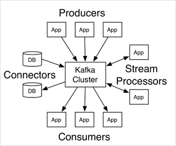

## kafka应用场景

1. **异步处理：**
   - **问题：**比较耗时的操作会阻塞用户回包，
   - **解决：**将耗时操作放在其他系统中，通过消息队列将需要进行处理的消息进行存储，其他系统可以消费消息队列中的数据。
   - 比较常见的耗时操作：发送短信验证码、发送邮件
2. **系统解耦：**
   - 原先一个微服务是通过接口调用另一个服务，这时候耦合很严重，只要接口发生变化就会导致系统不可用。
   - 使用消息队列可以将系统进行解耦合，第一个微服务可以将消息放入到消息队列中，另一个微服务可以从消息队列中把消息取出来进行处理，进行系统解耦。
3. **流量削峰：**
   - 因为消息队列时低延迟、高可靠、高吞吐的，可以应对高并发
4. **日志处理：**
   - 可以使用消息队列作为临时存储，或者一种通信管道

## 消息队列两种模型

生产者，消费者模型

1. **点对点模式：**一个生产者对应一个消费者，消费之后删除
2. **发布订阅模式：**一对多，一个消息可以可以被多个订阅者消费

## kafka

1. **Publish and subscribe：** 发布和订阅流数据流，类似于消息队列
2. **store：**以容错的持久化方式存储数据流？？？
3. **Process：**处理数据流（kafka stream类似于flink??）

通常把kafka用**在两类程序：**

1. 建立**实时数据管道**，用来可靠的在系统或应用程序之间获取数据。
2. 构建**实时流应用程序**，以转化或响应数据流。

​	

1. **Producers：**生产者，应用程序投递消息
2. **Consumers：**消费者，应用程序消费消息。
3. **Connectors：**kafka连接器可以把数据空中的数据导入到kafka，也可以把kafka的数据导出到数据库中。
4. **Stream Processers：**流处理器可以kafka中拉取数据，也可以将数据写入到kafka中。

## Kafka部署

[k8s部署](https://blog.51cto.com/binghe001/5245687)

## 基础操作

**Topic：**必须先创建topic，生产者生产消息到指定的topic中，消费者消费指定topic的数据。

```shell
cd opt/kafka/bin
# 增加topic
kafka-topics.sh --zookeeper [zookeeper cluster ip]:2181 --create --topic winters-1 --partitions 1 --replication-factor 1
# 删除topic
kafka-topics.sh --zookeeper [zookeeper cluster ip]:2181 --delete --topic winters-1
# 测试生产者
# 测试消费者
```

## Kafka概念

**broker：**单个kafka进程，broker-id

**zookeeper：**保存着kafka相关的一些元数据，使用kafkfatool工具可以看到（多少个topic，partition，consumer等），zk主要用于通知生产者和消费者kafka集群中有新的broker加入，或者kafka集群中出现故障的broker，主从partition。

**topic：**一个topic有多个分区（怎么保证读出的数据有序），和多个副本

- **partition分区：**数据分散存储，分区，将数据分在不同的broker上，解决单台文件的IO瓶颈。
- **replication副本：**数据备份，容灾，确保某台机器出现故障时，数据仍然可用（partition的copy）。
- **offset偏移量：**记录每个消费者消费partition的位置，拉模式，确保消费者宕机重启后还能从offset继续消费。默认存储在zk中。

**生产者：**向topic中生产数据

- **幂等性**(一次生产和多次生产操作的结果是一致的)：配置enable.idempotence，
  1. 生产者生产数据时会增加一个producer id(生产者唯一编号)和sequence number(针对消息的一个递增序列)，
  2. broker为每个topic的每个partition维护一个当前写成功的消息的最大PID-Sequence Number元组。
  3. ack响应失败，生产者重试，kafka判断sequence number是否小于等于partition中消息对应的sequence。
  4. broker失败重新选举新的leader时，去重机制仍然有效：因为 broker 的 topic 中存储的消息体中附带了 PID-sequence number 信息，且 leader 的所有消息都会被复制到 followers 中。当某个原来的 follower 被选举为新的 leader 时，它内部的消息中已经存储了PID-sequence number 信息，也就可以执行消息去重了。
- **生产者分区写入策略：**多个分区生产者写哪个
  1. **轮询：**默认，生产时key为null，轮询均匀分配分区。
  2. **随机：**不用
  3. **按key分配：**生产时相同key的分配到固定的几个分区，可能出现数据倾斜，某个key的数据太多，分区不均衡。
- **乱序问题：**Kafka中单个partition是有序的，全局是乱序的（生产者生产到多个partition，消费者从多个partition消费）
- **副本的acks：**leader和follower指的是partition，只有leader负责读写，follower副本分区只是用作容灾。
  - ack:0不管是否写入成功直接返回，可能有数据丢失。
  - ack:1 leader partition写完了就返回。
  - ack:-1/all leader和所有副本都同步成功之后才返回。

**consumer group消费者组：**消费者分组groupd.id内，一个消费者组共同消费一个或多个Topic。一个分区最多只能对应一个消费者来消费，消费者多于partition，多出的消费者消费不到数据。

- **消费者组的rebalance机制：**

  **不良影响：**Rebalance时消费者组下所有消费者都会通知工作，使用分配策略重新分配。

  **触发时机：**

  1. 消费者的组中的消费者的数量发生变化
  2. 订阅的topic的数量发生了变化
  3. 分区数量发生变化

- **消费者分区消费策略：**

  - **Range范围分配策略：**针对**每个Topic的partition**平均分配给消费者，分区除消费者的余数，将余数均匀分给前面的消费者

    **算法公式：**n = 分区数量/消费者数量，m=分区数量%消费者数量，前m个消费者消费n+1个分区，剩余消费者消费n个

    **配置：**partition.assignment.strategy设置为org.apache.kafka.clients.consumer.RangeAssignor

  - **RoundRobin轮询：** **所有topic的所有分区**按照字典序排序（topic和分区的hashcode进行排序），然后通过轮询方式逐个将分区分配给每个消费者。

  - **Stricky粘性分配：**分区分配尽可能均匀，在**发生rebalance的时候分区的分配尽可能与上次分配保持相同**。没有发生rebalance是和轮询一致。减少了不必要的系统开销（某个事务正在进行，可能需要取消重新执行）

## Kafka原理

1. **Leader和Follower:** 

   - Kafka中的Leader和Follower是相对分区有意义，不是相对broker。
   - Kafka在创建topic的时候，会尽量分配分区的leader在不同的broker上。
   - leader职责：读写数据
   - follower职责：同步数据，参与选举（leader crash之后，会选举一个follower重新称为分区的leader）
   - 注意和zookeeper区分：
     -  ZK的leader负责读写，follower可以读取。
     - Kafka的leader负责读写，follower不能读写数据（确保每个消费者消费的数据是一致的）

2. **AR、ISR、OSR: **Kafka把followe按照不同状态分为三类: AR，ISPR，OSR

   - **AR：**所有分区副本，Assigned Replicas分区所有副本

   - **ISR：**正在同步的分区副本，In Sync Replicas所有与leader分区保持一定程度同步的分区，包括leader。
   - **OSR:** 没有同步的分区副本，Out-of-Sync Replicas 与leader分区同步滞后过多的分区。
   - AR = ISR + OSR，正常情况下所有follower副本都应该与leader副本保持同步，AR=ISR且OSR为空

3. **Controller：**kafka启动时，会在所有的broker中选择一个controller

   - 创建topic，添加partition，修改replications数量之类的管理任务都是由controller完成的。kafka分区leader的选举也是由controller决定的

   - **Broker选举：**

     1. kafka集群启动时，每个broker都会尝试取Zookeeper上注册成为Controller（ZK临时节点），有一个竞争成为Controller之后，其余broker会注册该节点的监视器。

     2. 一旦临时节点状态发生变化，进行相应处理。如果Controller崩溃，其余broker重新竞选为Controller。

4. **Partion副本Leader选举：**

   - partion leader选举由controller决定，controller会将leader的改变直接通过rpc的方式通知需要为此做出相应的Broker

   - **选举规则：**

     1. controller读取当前分区的ISR，选择其中一个作为Leader。
     2. 没有则选择一个存活的replicas作为Leader。
     3. 所有replicas都宕机了，则新的leader为-1。

   - **为什么不用ZK来选举Partiton的Leader：**ZK选举速度满。如果kafka一个broker上可能有多个leader，一旦崩溃，需要有多个leader选举，对ZK的压力比较大，可以通过ISR可以快速选举。

   - **Leader负载均衡：**某个broker崩溃之后，partition副本的leader通过controller重新选举，会导致leader在broker上分布不均匀。通过下面的指令可以把partion副本leader分配到系统优先选择的broker上，确保leader是均匀分配的。

     ```
     bin/kafka-leader-election.sh
     ```

5. **生产消费流程：**

   - **生产者生产流程：**

     1. 通过zookeeper找leader partition所在的broker。

        - `“/brokers/topics/主题名/partitions/分区名/state”`节点里面的数据的leader字段，找到该partition的leader所在的brokerid。

        - `brokers/ids`可以查到broker的host和端口号

     2. 发送消息broker，leader partion将数据写入本地log中。

     3. 其余follower拉取并写入日志文件，返回ACK给Leader。

     4. 接收到所有ISR中replica的ACK后，返回ACK给生产者。
   - **消费者消费流程：**通过offset来确定自己可以消费的数据范围，并通过提交offset来跟踪消费进度，保证了单partition消费的有序性和容错性。
     1. 通过Zookeeper找leader partition所在broker，找消费者partition对应的offset
     2. 从offset往后顺序拉取数据。
     4. 提交offset（自动提交--每隔多少秒提交一次offset，手动提交--放入到事务中提交）

6. **Kafka数据存储形式：**topic->partition->segment段（包括三个文件.log数据，.index索引，.timeindex时间索引）

   - leo：持久化每个partition leader对应的LEO，log end offset日志文件中下一条待写入消息的offset

   - 每个日志文件名为起始偏移量（方便offset查找数据），每个日志文件最大为`[log.segment.bytes=1024*1024*1024]`1G

   - **读取流程：**

     1. 根据消费者的offset通过跳表找segment段
     2. 计算一下当前segment段的offset，根据.index稀疏索引查到.log的区间
     3. 在区间中用二分查找找具体的数据，消费

     **写入流程：**根据leo来写

     **删除流程：**消息定期清理，kafka的日志管理器根据kafka配置，一次删除一个segment段

7. **kafka消息不丢失：**

   - **broker数据不丢失：**通过partition的副本机制来保证。生产者通过分区的leader写入数据后，所有ISR的follower都会从leader复制数据，即使leader崩溃，follower中重新选举的leader仍然可用。

   - **生产数据不丢失：**通过ACK机制配置成-1来保证。-1所有节点写入成功，1leader，0不管是否写入直接返回

   - **消费者数据不丢失：**消费者自己保证消费成功之后再提交offset。

     - Flink消息传递的语义：

       - At-most once（只管数据消费到，不管有没有成功）
       - At-least once（失败，重新从offset消费，有可能重复消费）
       - Exactly once（事务性的保障，保证消息有且仅被处理一次，2PC）

     - **重复消费：**

       1. 未能正确提交新的offset，消费者从老的offset读，导致重复消费。
       2. 处理消息时超时，会把未确认的消息发给其他消费者。

       **解决：**做幂等

8. **数据积压：**消费者处理不过来

9. **数据清理：**log.cleaner.enable

   **两种处理：**log.cleanup.policy，删除delete和压缩compaction

   - **删除：**以段为单位删除日志，先删除segment跳表中的索引字段（保证不会被读），文件加一个.delete后缀，延迟file.delete.delays.ms后删除。
     - **日志保留策略：**
       - 基于时间：log.retention.ms默认5分钟，日志超过时间删除
       - 基于日志大小：log.retention.bytes，日志所有段总大小超出限制删除
       - 基于日志起始偏移量：起始偏移量小于 logStartOffset删除。
   - **压缩：**针对key，会将相同的key对应的数据只保留一个版本。
     - 执行前后每条消息的偏移不变，offset不在连续（删除了一些非最新value），可以基于log compaction恢复消费者最新状态。

   

   

## 高级API

高级API：就是直接让Kafka帮助管理、处理分配、数据，开发起来比较简单，无需开发者关注底层细节，我i发做到细粒度的控制。

- offset存储在ZK中，由kafkfa的rebalance来控制消费者分配的分区

低级API：由编写的程序自己控制逻辑。可以做到细粒度的控制，原有的Kafka的策略会失效，需要我们自己来实现消费机制。

- 自己来管理Offset，可以将offset存储在ZK，MYSQL，Redis，HBASE，Flink的状态存储。自己指定消费者拉某个分区的数据

### Kafka监控

Kafka-Eagle可视化工具，监控offset，lag，partition，leader等的变化


## 

